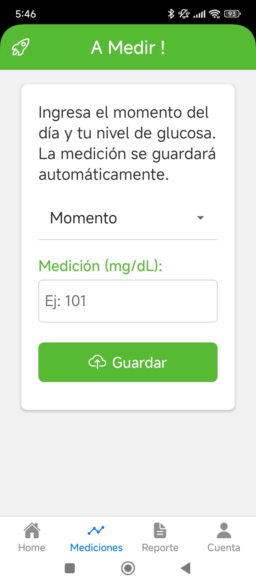
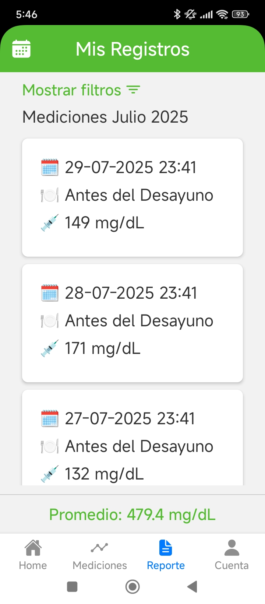

# 📱 Glice-Track MPV

Aplicación móvil desarrollada con **React Native** y **Expo**. para medir el control de glicemia (azucar en la sangra) , para prevenir o mantener estable la Diabetes

## 🚀 Características

- Construido con React Native + Expo
- Navegación con React Navigation
- Integración con Supabase 
- Compatible con Android 
- Soporte para TypeScript

## 📦 Tecnologías

- React Native
- Expo
- TypeScript
- Supabase 
- React Navigation

## 📸 Capturas de pantalla




## ▶️ Instalación y ejecución

```bash
git clone https://github.com/barrerasaezgonzalo/glice_track-MVP.git
cd glice_track-MVP
npm install
npx expo start
